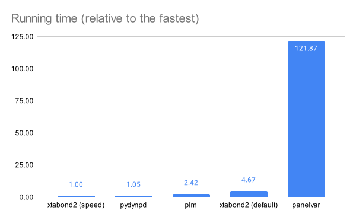

The objective of the package is similar to the following open-source packages: <br>
Package | Language
--- | --- 
plm | R
panelvar | R
pdynmc | R

To compare pydynpd with similar packages, we performed two performance tests. More specifically, in each test for each package we run 100 times to estimate the same model with the same data. For verification, the tests also include Stata package xtabond2 though Stata is a commercial software. Please note that the main reason we include xtabond2 is for regression result verification (\*). Directly comparing its speed with R or Python packages is a little unfair because the calculation part of xtabond2 was compiled while pydynpd and the three R packages are interpreted; xtabond2 should have a clear advantage on speed. 

*Note: xtabond2 is the most popular package on dynamic panel model as evidenced by the 9667 citations it has received according to google scholar as of April 3, 2022. It also won 

## Test configuration
### Hardware
Intel CPU 9700K (8 cores) <br>
Memory: 64GB <br>

### Software
Debian-based Linux (Deepin 20.04) <br>
R 4.1.2 <br>
Python 3.9 <br>
To make our comparison fair, we configured both R and Python to link to Intel's Math Kernal Libarary (MKL).

Configuration of R:
```
> sessionInfo()
R version 4.1.2 (2021-11-01)
Platform: x86_64-pc-linux-gnu (64-bit)
Running under: Deepin 20.4

Matrix products: default
BLAS/LAPACK: /opt/intel/compilers_and_libraries_2020.4.304/linux/mkl/lib/intel64_lin/libmkl_gf_lp64.so
```
Configuration of Python Numpy:
```
numpy.show_config()
blas_armpl_info:
  NOT AVAILABLE
blas_mkl_info:
    libraries = ['mkl_rt', 'pthread', 'mkl_rt']
    library_dirs = ['/opt/intel/compilers_and_libraries/linux/mkl/lib/intel64']
    define_macros = [('SCIPY_MKL_H', None), ('HAVE_CBLAS', None)]
    include_dirs = ['/opt/intel/compilers_and_libraries/linux/mkl/include']
blas_opt_info:
    libraries = ['mkl_rt', 'pthread', 'mkl_rt']
    library_dirs = ['/opt/intel/compilers_and_libraries/linux/mkl/lib/intel64']
    define_macros = [('SCIPY_MKL_H', None), ('HAVE_CBLAS', None)]
    include_dirs = ['/opt/intel/compilers_and_libraries/linux/mkl/include']
```

The tests are based on the data set employed in Arellano and Bond (1991) and is avaialble from R package panelvar. 

In the tests, we considered the following model:

$$ n_{i,t}=\alpha_1 n_{i,t-1} + \alpha_2 n_{i,t-2} + \beta_1 w_{i,t} + \beta_2 k_{i,t} $$

We performed two tests. Test 1 is a difference GMM and test 2 a system GMM. R/Python Scripts and regression results are included in test_1.ipynb and test_2.ipynb. Stata scripts and results are stored in ...

First, in test 1 (difference GMM) all of five packages produced the identical estimates. Second, in test 2 (system GMM), pydynpd, panelvar, and xtabond2 have the same results. plm is close. R package pdynmc doesn't work. 

## Test 1: Difference GMM
Codes are stored in test1.R, test1.py, and test1.do. As shown in ... html, they produced the same results.

| Package            | Running Time | Relative to the fastest |
| ------------------ | ------------ | ----------------------- |
| xtabond2 (speed)   | 4.19         | 1.00                    |
| pydynpd            | 4.81         | 1.15                    |
| panelvar           | 661.893      | 157.97                  |
| plm                | 11.02        | 2.63                    |
| pdynmc             | 167.4        | 39.95                   |
| xtabond2 (default) | 18.369       | 4.38                    |


## Test 2: System GMM

| Package            | Running Time | Relative to the fastest |
| ------------------ | ------------ | ----------------------- |
| xtabond2 (speed)   | 5.893        | 1.00                    |
| pydynpd            | 6.21         | 1.05                    |
| plm                | 14.26        | 2.42                    |
| xtabond2 (default) | 27.536       | 4.67                    |
| panelvar           | 718.2        | 121.87                  |
| pdynmc             | NA           | NA                      |




Their estimates and running times (i.e., total running time of 100 tests) are shown in table below. Scripts of this test are included in the "Benchmark" folder. 

